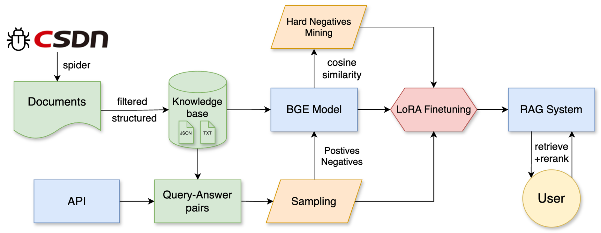
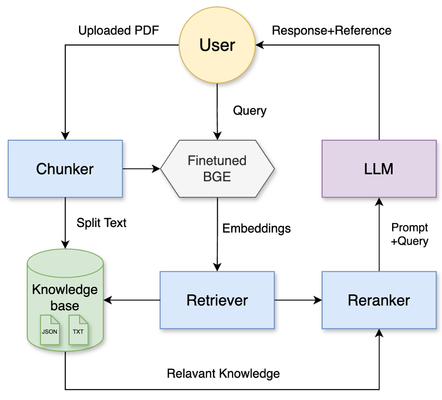

# nlp2025_group_5

> **NLP课程设计项目** - 基于LangChain的本地知识库智能检索与问答增强

组号：5

组长：王博远 2022211738

组员：池瀚 2022211740

一个端到端的RAG（检索增强生成）系统，通过爬取CSDN机器学习技术博客，对BGE模型进行领域专业化微调，最终实现高质量的机器学习知识问答和文档分析服务。

## 项目亮点

- **智能数据采集**：爬取并筛选827篇高质量机器学习技术博客
- **模型精准微调**：基于LoRA对BGE-large-zh-v1.5进行领域专业化优化
- **创新负样本挖掘**：结合语义相似度、关键词重叠、TF-IDF等多策略困难负样本挖掘
- **微服务架构**：检索、重排序、生成服务解耦设计
- **多模态交互**：支持知识库问答、PDF文档分析、文章浏览等功能

## 项目结构

```
nlp2025_group_5/
├── csdn_spider/                # 数据采集模块
│   ├── csdn_spider.py          # 文章列表爬虫
│   ├── single_article.py       # 文章内容爬虫
│   ├── qa.py                   # QA对生成器
│   └── articles/               # 文章正文存储
├── bge_finetune/                     # 模型微调模块
│   ├── enhanced_data_preparation.py  # 数据准备
│   ├── hard_negative_mining.py       # 困难负样本挖掘
│   ├── model_training.py             # 模型训练
│   ├── model_evaluation.py           # 性能评估
│   ├── data/                         # 训练数据
│   ├── models/                       # 模型文件
│   └── outputs/                      # 输出结果
├── rag_system/                 # RAG系统模块
│   ├── app.py                  # Streamlit主应用
│   ├── src/                    # 核心模块
│   │   ├── services/           # 微服务架构
│   │   ├── config.py           # 配置文件
│   └── └── ...                 # 其他核心模块
├── requirements.txt      # 依赖文件
└── README.md             # 项目说明
```

## 目录

- [系统架构](#-系统架构)
- [数据统计](#-数据统计)
- [技术栈](#-技术栈)
- [如何运行](#-如何运行)
- [配置说明](#-配置说明)
- [功能演示](#-功能演示)
- [模块详解](#-模块详解)
- [性能评估](#-性能评估)

## 系统架构



系统采用模块化设计，包含三个核心模块：

1. **数据采集模块** (`csdn_spider/`) - 爬虫框架，负责数据采集和QA对生成
2. **模型微调模块** (`bge_finetune/`) - BGE模型领域专业化微调
3. **RAG系统模块** (`rag_system/`) - 完整的问答系统实现

## 数据统计

### 数据类型及数量说明

- **原始文章：**1,500+篇CSDN机器学习相关技术博客
- **高质量文章：**827篇经过质量筛选的优质内容
- **QA对：**1,830个QA对用于模型微调的问答对
- **正样本：**4,148个正样本对用于训练
- **负样本：**2,903个包含困难负样本的训练数据
- **困难负样本：**2,032个多策略挖掘的困难样本

### 数据示例

<details> <summary>文章元信息示例</summary>

```json
{
  "article_id": "137581920",
  "title": "【机器学习-16】贝叶斯（Bayes）算法：原理、应用与优化",
  "link": "https://blog.csdn.net/qq_38614074/article/details/137581920",
  "content_preview": "贝叶斯算法在机器学习中扮演着至关重要的角色...",
  "read_count": "阅读 3.0w",
  "like_count": "257赞",
  "collect_count": "收藏 455"
}
```

</details> 

<details> <summary>QA对示例</summary>

```json
{
  "question": "什么是样本复杂性在机器学习中的核心指标？",
  "answer": "样本复杂性是决定模型能否高效学习的核心指标，它量化了为达到特定性能需要多少数据的关键问题。",
  "source_article_id": "148046318",
  "source_title": "样本复杂性：机器学习的数据效率密码"
}
```

</details>

## 技术栈

### 核心框架

- **深度学习**: PyTorch, Transformers, Sentence-Transformers
- **RAG框架**: LangChain, FAISS
- **Web框架**: Streamlit
- **爬虫工具**: Selenium, BeautifulSoup4

### 数据处理

- **文本处理**: jieba分词, TF-IDF
- **数据分析**: pandas, numpy, matplotlib
- **向量存储**: FAISS

### 模型与算法

- **嵌入模型**: BGE-large-zh-v1.5 (微调)
- **微调方法**: LoRA (Low-Rank Adaptation)
- **检索算法**: 向量检索 + BM25混合
- **重排序**: BGE-reranker-v2-m3

## 如何运行

### 环境要求

- Python 3.8+
- CUDA 11.6+ (推荐GPU: 24GB显存)
- Chrome浏览器 (用于爬虫)

### 安装依赖

```bash
# 克隆项目
git clone https://github.com/buptNLP/nlp2025_group_5.git
cd nlp2025_group_5

# 安装基础依赖
pip install -r requirements.txt

# GPU支持 (推荐)
pip install torch torchvision torchaudio --index-url https://download.pytorch.org/whl/cu118
```

### 一键运行

```bash
# 1. 数据采集 (已提供部分预处理数据)
cd csdn_spider
python csdn_spider.py
python single_article.py
python qa.py

# 2. 模型微调 
cd ../bge_finetune
python enhanced_data_preparation.py
python model_training.py
python model_evaluation.py

# 3. 启动RAG系统
cd ../rag_system
streamlit run app.py
```

访问 `http://localhost:8501` 开始使用！

## 配置说明

### 环境变量设置

```bash
# API配置
export API_BASE="https://your-api-base"
export API_KEY="your-api-key"

# 模型路径
export BGE_MODEL_PATH="./bge_finetune/models/finetuned_bge_*"
export BGE_RERANKER_PATH="./models/bge-reranker-v2-m3"
```

### 自定义配置

编辑 `rag_system/src/config.py` 文件：

```python
# 检索参数
RETRIEVAL_TOP_K = 20        # 初始检索数量
COARSE_TOP_K = 10          # 粗排保留数量  
FINE_TOP_K = 3             # 精排最终数量

# 混合检索权重
ALPHA = 0.7                # 向量检索权重
```

## 功能演示

### 1. 多轮对话

> 机器学习领域专业问答，提供智能领域过滤、引用展示

https://github.com/user-attachments/assets/ef17eec5-c2b7-45b9-bf66-62c519705b4a

### 2. PDF文档问答

> 上传文档进行智能问答，集成双粒度检索、混合重排序

https://github.com/user-attachments/assets/b7d792ce-4e4c-47e0-a7f3-0e0c37dfbcc8

### 3. 知识库浏览

> 浏览精选技术博客，支持多维搜索、统计展示

https://github.com/user-attachments/assets/a508cd78-8ef8-4b83-94c6-d8ca97ab64d5

## 模块详解

### 1. 数据采集模块 (`csdn_spider/`)

负责从CSDN平台爬取机器学习相关技术博客，构建高质量知识库。

**核心特性**：

- 增量爬取，避免重复
- 智能内容筛选
- 自动QA对生成
- 结构化数据存储

**使用方法**：

```bash
cd csdn_spider
python csdn_spider.py        # 爬取文章列表
python single_article.py     # 获取文章内容
python qa.py                 # 生成QA对
```

### 2. 模型微调模块 (`bge_finetune/`)

对BGE-large-zh-v1.5模型进行机器学习领域专业化微调。

**技术亮点**：

- **LoRA微调**：参数高效的模型优化
- **困难负样本挖掘**：5种策略提升训练质量
- **实时评估**：训练过程性能监控
- **自动保存**：最佳模型检查点管理

**困难负样本挖掘策略**：

1. **语义相似度**：余弦相似度筛选
2. **关键词重叠**：TF-IDF关键词匹配
3. **跨子领域**：不同子领域样本混合
4. **长度相似**：文本长度相近的样本
5. **随机采样**：保证样本多样性

```bash
cd bge_finetune
python enhanced_data_preparation.py  # 数据准备
python model_training.py             # 模型训练
python model_evaluation.py           # 性能评估
```

### 3. RAG系统模块 (`rag_system/`)

完整的RAG问答系统，采用微服务架构设计。



**架构特色**：

- **微服务解耦**：检索、重排序、生成服务独立
- **混合检索**：向量检索 + BM25检索融合
- **性能监控**：实时服务调用统计
- **友好界面**：Streamlit Web应用

**服务架构**：

```
RetrievalService (检索) → RerankingService (重排序) → GenerationService (生成)
```

**使用方法：**

```bash
cd rag_system
streamlit run app.py
```

## 性能评估

### 检索性能指标

| **Metrics** | **Epoch_1** | **Epoch_2** | **Epoch_3** |
| ----------- | ----------- | ----------- | ----------- |
| Accuracy@1  | 66.29%      | **69.82%**  | 67.74%      |
| Accuracy@3  | 82.66%      | **84.59%**  | 80.58%      |
| Accuracy@5  | 86.36%      | **87.64%**  | 84.11%      |
| Precision@1 | 66.29%      | **69.82%**  | 67.74%      |
| Precision@3 | 27.55%      | **28.20%**  | 26.86%      |
| Precision@5 | 17.27%      | **17.53%**  | 16.82%      |
| Recall@1    | 66.29%      | **69.82%**  | 67.74%      |
| Recall@3    | 82.66%      | **84.59%**  | 80.58%      |
| Recall@5    | 86.36%      | **87.64%**  | 84.11%      |
| MRR@10      | 0.7538      | **0.7793**  | 0.7491      |
| NDCG@10     | 0.7913      | **0.8116**  | 0.7788      |
| MAP@100     | 0.7572      | **0.7824**  | 0.7534      |

### 模型微调性能对比

| **Metrics**             | **Vanilla** | **Finetuned** | **Absolute** | **Relative** |
| ----------------------- | ----------- | ------------- | ------------ | ------------ |
| accuracy                | 88.85%      | 95.18%        | +6.33%       | **+7.13%**   |
| best_accuracy           | 89.79%      | 96.22%        | +6.43%       | **+7.16%**   |
| auc_approx              | 94.10%      | 98.86%        | +4.76%       | **+5.06%**   |
| similarity_separation   | 0.2787      | **0.7817**    | +0.5030      | **+180.45%** |
| avg_positive_similarity | 0.7062      | 0.8977        | +0.1915      | **+27.12%**  |
| avg_negative_similarity | 0.4274      | 0.1160        | -0.3115      | **-72.87%**  |
