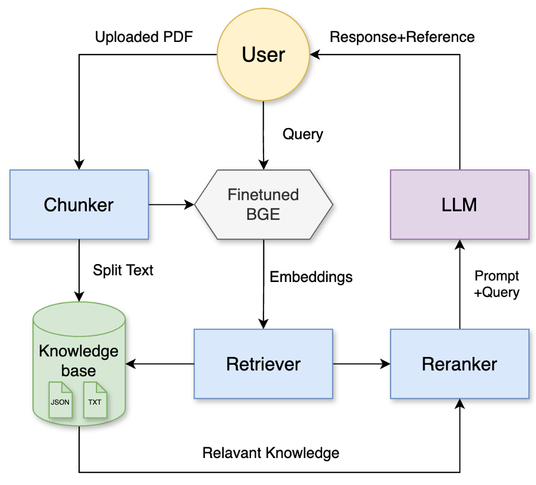

# RAG系统集成模块

本模块实现了完整的RAG（检索增强生成）问答系统，是项目的**最终应用层**，集成前述所有模块成果。

## 项目关系

此模块是整个项目的集大成者，集成了前面所有模块的输出：

```
爬虫数据 → BGE模型微调 → RAG系统集成 → Web应用界面
```

主要功能：

- 集成微调后的BGE模型进行文档检索
- 实现微服务架构的RAG流水线
- 提供多种交互模式的Web界面
- 支持知识库问答和PDF文档分析



## 文件结构

### 核心应用

```
├── app.py                      # Streamlit主应用入口
├── fix_torch_streamlit.py      # PyTorch兼容性修复
```

### 核心模块 (src/)

```
├── config.py                   # 配置文件
├── document_loader.py          # 文档加载器
├── embeddings.py               # 嵌入模型封装
├── hybrid_retriever.py         # 混合检索器
├── llm.py                      # 大语言模型接口
├── reranker.py                 # 重排序模块
├── retriever.py                # 基础检索器
```

### 微服务架构 (src/services/)

```
├── base_service.py             # 服务基类
├── retrieval_service.py        # 检索微服务
├── reranking_service.py        # 重排序微服务
└── generation_service.py       # 生成微服务
```

## 环境依赖

```bash
pip install streamlit langchain langchain-community faiss-gpu
pip install sentence-transformers transformers torch
pip install openai rank-bm25 jieba plotly
```

需要：

- Python 3.8+
- GPU支持 (推荐)
- 已完成前述模块的数据和模型准备

## 配置设置

### 1. 模型路径配置

在 `src/config.py` 中设置：

```python
BGE_MODEL_PATH = "models/finetuned_bge_*"  # 微调后的BGE模型路径
BGE_RERANKER_PATH = "models/bge-reranker-v2-m3"
```

### 2. API配置

```python
API_BASE = "https://your-api-base"
API_KEY = "your-api-key"
MODEL = ""
```

### 3. 数据路径配置

```python
DATA_FILE = "data/csdn_articles_filtered.json"
ARTICLES_DIR = "articles/"
```

## 运行方法

### 启动Web应用

```bash
streamlit run app.py
```

访问 `http://localhost:8501` 打开Web界面。

## 功能模块

### 1. 多轮对话 💬

- **智能领域过滤**：自动识别机器学习相关问题
- **知识库检索**：基于827篇技术博客进行语义检索
- **参考资料展示**：提供可折叠的引用文献
- **对话历史保持**：支持上下文连续对话

### 2. PDF文档问答 📄

**微服务架构流程**：

```
PDF上传 → 文档分块 → 检索服务 → 重排序服务 → 生成服务 → 回答输出
```

**技术特色**：

- **双粒度检索**：段落级精确检索 + 文档级全局理解
- **混合检索策略**：向量检索 + BM25检索融合
- **两阶段重排序**：粗排快速筛选 + 精排深度排序
- **实时性能监控**：各服务耗时和调用统计
- **可视化流程**：检索→重排→生成全流程展示

### 3. 知识库浏览 📚

- **精选文章**：精选的机器学习技术博客
- **多维搜索**：关键词搜索 + 多种排序方式
- **统计信息**：阅读量、点赞数、收藏数展示
- **分页浏览**：优化大数据量展示体验

## 系统架构

### 微服务设计

```python
BaseService (基类)
├── RetrievalService    # 检索微服务
├── RerankingService    # 重排序微服务
└── GenerationService   # 生成微服务
```

**设计优势**：

- **服务解耦**：各模块独立运行，便于维护
- **性能监控**：内置调用统计和耗时分析
- **错误处理**：完善的异常处理和降级机制
- **统一接口**：标准化的服务调用格式

### 混合检索策略

```python
# 检索权重配置
alpha = 0.7  # 向量检索权重
retrieval_top_k = 20    # 初始检索数量
coarse_top_k = 10       # 粗排保留数量  
fine_top_k = 3          # 精排最终数量
```

## 性能特色

### 1. 智能文档处理

- **语义分块**：基于内容语义的智能分段
- **元数据保持**：文件名、页码等信息保留
- **多格式支持**：PDF文档自动解析

### 2. 检索优化

- **困难负样本训练**：微调后的BGE模型检索精度更高
- **混合检索策略**：向量语义 + 关键词匹配双重保障
- **动态权重调节**：可调节检索策略偏好

### 3. 用户体验

- **实时进度显示**：各阶段处理状态可视化
- **详细结果展示**：检索过程和结果完全透明
- **性能统计图表**：耗时分布饼图分析

## 故障排除

### 常见问题

1. **PyTorch兼容性**：已内置 `fix_torch_streamlit.py` 修复
2. **模型加载失败**：检查模型路径和GPU内存
3. **API调用超时**：检查网络连接和API配置
4. **内存不足**：调整batch_size参数

### 调试模式

```bash
# 启用详细日志
streamlit run app.py --logger.level=debug
```

## 部署建议

1. **生产环境**：建议使用Docker容器化部署
2. **性能优化**：GPU加速，调整并发参数
3. **监控告警**：集成APM工具监控服务健康度
4. **数据备份**：定期备份知识库和模型文件